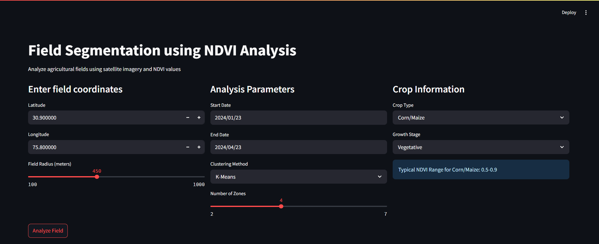
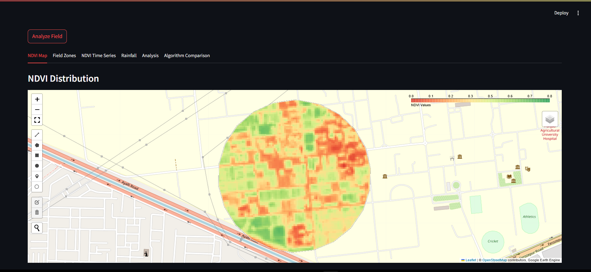
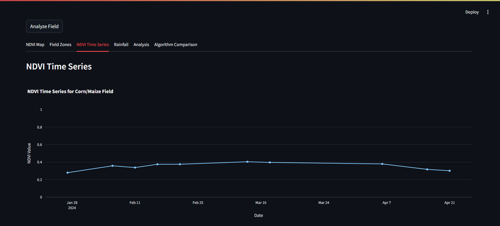
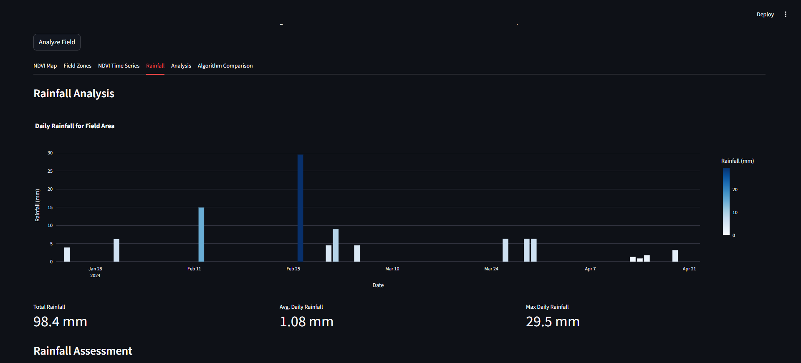

# NDVI-Based Field Segmentation

[](https://streamlit.io)  [](LICENSE)

A web application for analyzing agricultural fields using satellite imagery and NDVI (Normalized Difference Vegetation Index) data to create management zones for precision agriculture like zoning based on yield of the field areas.

---

## Table of Contents

- [Overview](#overview)
- [Features](#features)
- [Installation](#installation)
- [Usage](#usage)
- [Technical Details](#technical-details)
- [Demo](#screenshots)
- [Example Use Cases](#example-use-cases)
- [Contributing](#contributing)
- [License](#license)
- [Acknowledgments](#acknowledgments)

---

## Overview

This application leverages Google Earth Engine and Sentinel-2 imagery to compute NDVI values across agricultural fields. By clustering field pixels into management zones, farmers and agronomists can make data-driven decisions on irrigation, fertilization, and pest management.

Key capabilities include:

- Computation of median NDVI over a selected date range
- Integration of daily rainfall (CHIRPS) to correlate weather with crop health
- Customizable clustering algorithms
- Time-series visualization of vegetation dynamics

---

## Features

- **Interactive Field Selection**: Input latitude, longitude, and radius to define the target field.
- **Multiple Clustering Methods**: K-Means, DBSCAN, Mean Shift, or Gaussian Mixture Models (GMM).
- **NDVI Time Series Analysis**: View historical NDVI trends for monitoring crop development.
- **Rainfall Data Integration**: Overlay precipitation patterns to diagnose water stress.
- **Crop-Specific Insights**: Tailor analysis to crop type and growth stage.
- **Downloadable Reports**: Export CSV and PDF summaries of zone statistics and time-series data.
- **Algorithm Comparison**: Side-by-side evaluation of clustering outcomes.
- **Interactive Maps**: Color-coded maps of NDVI and management zones.
- **Parameter Tuning**: Adjust time window, clustering parameters, and data thresholds.

---

## Installation

### Prerequisites

- Python 3.7 or higher
- Google Earth Engine account
- [Streamlit](https://streamlit.io)

### Setup

1. Clone the repository:
   ```bash
   git clone https://github.com/Priyam-28/CropSight.git
   cd ndvi-field-segmentation
   ```

2. Install dependencies:
   ```bash
   pip install -r requirements.txt
   ```

3. Authenticate Earth Engine:
   ```bash
   earthengine authenticate
   ```

---

## Usage

1. Launch the app:
   ```bash
   streamlit run app.py
   ```

2. In the browser UI:
   - Enter your field’s **latitude** and **longitude**.
   - Specify a **radius** (in meters) around the point.
   - Choose a **date range** for analysis.
   - Select your **crop** type and **growth stage**.
   - Pick a **clustering algorithm** and adjust its parameters.
   - Click **Analyze Field**.

3. Navigate tabs:
   - **NDVI Map**: Visualize spatial NDVI distribution.
   - **Field Zones**: Explore segmented management zones.
   - **Time Series**: Inspect NDVI trends over time.
   - **Rainfall**: Check precipitation alongside NDVI.
   - **Analysis**: View statistics and tailored recommendations.
   - **Comparison**: Compare multiple clustering outputs.

---

## Technical Details

### Data Sources

- **Sentinel-2** (10 m resolution) for imagery.
- **CHIRPS** daily precipitation dataset.

### Processing Workflow

1. **Fetch** Sentinel-2 image collection for selected dates.
2. **Compute** NDVI for each scene: `(NIR - RED) / (NIR + RED)`.
3. **Aggregate** to median NDVI mosaic.
4. **Cluster** pixel values into zones using chosen algorithm.
5. **Extract** NDVI & rainfall time series for the field.
6. **Generate** statistics (mean, std, zone area) and insights.

### Clustering Options

| Algorithm  | Description                                           |
|------------|-------------------------------------------------------|
| **K-Means** | Fast, requires preset # of clusters                   |
| **DBSCAN**  | Density-based, auto-detects clusters and outliers     |
| **Mean Shift** | Mode-seeking, no need for cluster count             |
| **GMM**     | Probabilistic, handles overlapping clusters           |

---

## Screenshots

### Select Crop and Field


### Field Zones


### NDVI Time Series


### Rainfall Analysis



---

## Example Use Cases

1. **Variable Rate Application**: Generate prescription maps for targeted inputs.
2. **Irrigation Management**: Detect water-stressed zones for optimized watering.
3. **Yield Estimation**: Correlate NDVI patterns with expected yield.
4. **Problem Spotting**: Identify underperforming patches for intervention.
5. **Seasonal Tracking**: Monitor crop growth throughout the season.

---

## Contributing

Contributions welcome! Please follow these steps:

1. Fork the repo and create a branch: `git checkout -b feature/YourFeature`
2. Commit your changes: `git commit -m "Add new feature"`
3. Push to your branch: `git push origin feature/YourFeature`
4. Open a Pull Request.

---

## License

This project is licensed under the MIT License. See the [LICENSE](LICENSE) file for details.

---

## Acknowledgments

- **Google Earth Engine** for satellite data access.
- **Sentinel-2 mission** for high-resolution imagery.
- **CHIRPS** for global precipitation datasets.
- **Streamlit** for the interactive UI.

